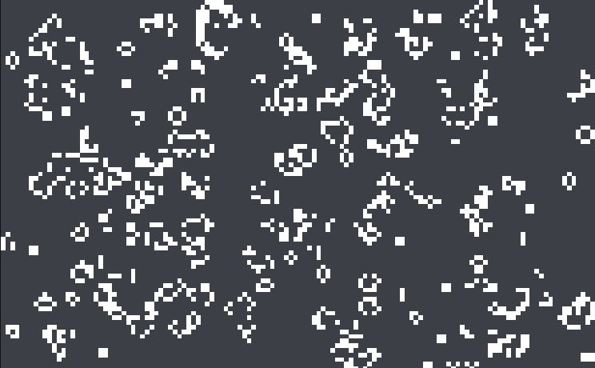

# Game-Of-Life-with-CSharp-and-Unity
The Unity version 2021.3.13f1

Instructions for Windows:

-In the Hierarchy click on CreateBugs.

-In the Inspector check the Bugs Component and write the number of columns and rows, the aspect ratio must be 16:10 (Ex. 16 Columns and 10 Rows).

-Click PLAY.

# -ENJOY THE GAME OF LIFE

